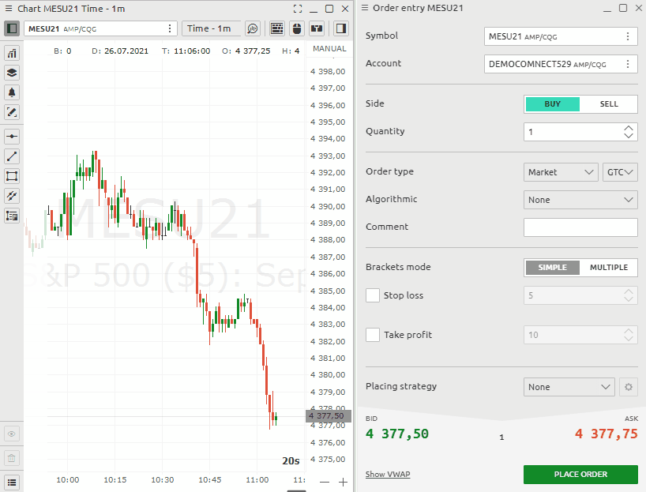

# Order Entry for CQG

### \*\*\*\*[**How to place an order from the OE \(Order Entry\) panel**](order-entry-for-cqg.md#how-to-place-an-order-from-the-oe-order-entry-panel)\*\*\*\*

* \*\*\*\*[**How to open the Order Entry panel**](order-entry-for-cqg.md#how-to-open-position-with-sl-and-tp-from-order-entry)\*\*\*\*
* [**General view of the OE \(Order Entry\) panel for AMP/CQG**](order-entry-for-cqg.md#the-general-view-of-the-order-entry-panel-for-cqg-connection)\*\*\*\*
* \*\*\*\*[**Order parameters — Type, Price, Quantity**](order-entry-for-cqg.md#selection-of-order-type-time-if-force-and-order-quantity)\*\*\*\*
* \*\*\*\*[**How to set TP \(take profit\) and SL \(stop loss\)**](order-entry-for-cqg.md#how-to-set-tp-take-profit-and-sl-stop-loss)\*\*\*\*
* \*\*\*\*[**How to set up  several Take profit and Stop Loss orders for one position**](order-entry-for-cqg.md#how-to-set-up-several-take-profit-and-stop-loss-orders-for-one-position)\*\*\*\*
* \*\*\*\*[**How to set up Traling Stop**](order-entry-for-cqg.md#how-to-set-up-traling-order)\*\*\*\*

### \*\*\*\*[**How to place an order from the Chart quick trading sidebar**](order-entry-for-cqg.md#how-to-place-an-order-from-the-chart-trading-sidebar)\*\*\*\*

* \*\*\*\*[**General view of Chart** ](order-entry-for-cqg.md#general-view-of-chart)\*\*\*\*
* \*\*\*\*[**Order quantity selection**](order-entry-for-cqg.md#quick-order-quantity-buttons)\*\*\*\*
* \*\*\*\*[**Quick order quantity buttons**](order-entry-for-cqg.md#quick-order-quantity-buttons)\*\*\*\*
* \*\*\*\*[**Quick change order amount buttons**](order-entry-for-cqg.md#quick-change-order-amount-buttons)\*\*\*\*
* \*\*\*\*[**How to set up Take Profit and Stop Loss orders**](order-entry-for-cqg.md#how-to-set-up-profit-and-stop-orders)\*\*\*\*
* \*\*\*\*[**How to set up  several Take profit and Stop Loss orders for one position**](order-entry-for-cqg.md#how-to-set-up-several-profit-and-stop-orders-foe-one-position)\*\*\*\*
* \*\*\*\*[**Quickly placing order buttons**](order-entry-for-cqg.md#quickly-placing-order-buttons)\*\*\*\*

### \*\*\*\*[**Mouse trading**](order-entry-for-cqg.md#mouse-trading)\*\*\*\*

* \*\*\*\*[**How to set up Take Profit and Stop Loss orders for the limit order**](order-entry-for-cqg.md#how-to-set-up-profit-and-stop-orders-for-limit-order)\*\*\*\*
* \*\*\*\*[**How to set up  several Take profit and Stop Loss orders for the limit order**](order-entry-for-cqg.md#how-to-set-up-multiple-profit-and-stop-orders-for-the-limit-order)\*\*\*\*
* \*\*\*\*[**How to set up many limit orders**](order-entry-for-cqg.md#how-to-set-up-many-limit-orders)\*\*\*\*

### Quick order entry

* **How to open Quick order entry**
* **How to set volume quantity**

### Keyboard trading

* **How to activate trading with hot keys**

### How to place an OCO order

## **How to place an order from the OE \(Order Entry\) panel**

### How to open the Order Entry panel?

Open the main menu by clicking the logo and in the **Trading section** click on the OE icon.

### The general view of the Order Entry panel for CQG connection 

The entire panel is conventionally divided into several **zones**:

* choice of trading instrument and trading account;
* setting the required order type, TIF condition, order quantity, and the order side \(Buy or Sell\);
* setting of the order price, stop loss and take profit prices;
* order placing strategy for advanced trading algorithms
* information on current Ask and Bid prices, spread size, as well as an order placement button

### Selection of Order Type, Time if Force and Order Quantity

AMP/CQG exchange provides 2 main order types: **Market, Limit**

All contracts in AMP/CGQ are standardized with leverage. This means that to set the entry volume you need to specify in the **Quantity field** the required number of contracts. Specification of the contracts you can get on the AMP official website.

## CQG OrderTypes, Time in Force \(TIF\), Algorithmic in Quantower

CQG provides various order types for trading via the Order Entry panel:

* Market order
* Limit order
* Stop order
* Stop limit order

**Time-in-force \(TIF\)** instructions define the length of time over which an order will continue working before it is canceled. CQG provides various TIFs:

* **GTC \(Good till canceled\)** — orders will remain working until they are canceled by trader or the contract expires;
* **FOK \(or Fill or Kill\)** —  order will be canceled if it is not executed in the entire volume as soon as it becomes available;
* **IOC \(Immediate or cancel\)** — requires that any portion of an order that is not filled as soon as it becomes available in the market is canceled;
* **DAY** — order will be canceled if it is not executed within the current trading day;
* **GTD \(Good till date\)** — order will remain working within the system and in the marketplace, until it executes or until the close of the market on the date specified.
* **GTT \(Good till time\)** — order that remains open until a specified time. At that time, any unfilled lots are canceled.
* **FAK** \(**Fill and Kill\)** — ****orders require that any remaining quantity after a partial fill be canceled.
* **ATC \(At the Close Order\)** — order to buy or sell a stock at the closing price. One of the benefits of this type of order is that it can be placed prior to the actual end of the trading day requested. This would be the opposite of an at-the-open order.
* **ATO \(At-The-Open Order\)** — order to buy or sell a stock at the opening price. ATO order is allowed during pre-open sessions \(morning and afternoon\) or even the night before.

### **How to set TP \(take profit\) and SL \(stop loss\)**

To set a bracket order with Sl and Tp, follow these steps as shown in the picture below: 

* Set the necessary lot to enter 
* Set Sl in pips 
* Set Tp in pips

If one of the orders Sl or Tp is executed, the opposite order will be automatically deleted.

### How to set up  several Take profit and Stop Loss orders for one position

Тo set multiple stop orders for a single position, do the following Switch the bracket \(stop\) settings to multi mode 

* Enter data for setting the first limit orders and how many lots or coins should be closed 
* For the next stops, enter similar data on the next line.
*  You can set orders in multiples of your total volume

### How to set up traling order

AMP/CQG support **server-side trailing orders**. To set such an order you must Select order type select TRAIL item in Algorithmic trading Specify the parameters of this Price and the offset for the movement

## **How to place an order from the Chart trading sidebar**

### **General view of Chart**

The general view of the order entry panel for AMP/CQG connection looks like the following and is divided into the following categories: 

* Account and symbol selection 
* Order volume selection and direction selection
* Order parameters - type, TIF, price, algorithmic settings. 
* Mode for Stop Loss and Take Profit. 
* Order placement parameters \(strategy\)

### **Quick order quantity buttons**

To set an order, you need to specify the volume in lots according to the chosen symbol. You can do this in several ways. 

* Specify the volume directly in the quantyti field 
* Preset your normal trading volume in lots.

### Quick change order amount buttons 

The quick change order amount buttons will help you change the specified volume in one click, based on your trading strategy. You can set by default any parameters that you need to quickly change the values. Moreover, the buttons can change not only the specified position volume, but also apply any \(!!!\) formulas to calculate the order volume. To set your personal values for a quick change of the order, you need to go to the settings of the chart in the menu section "Order entry" and find the field "OE buttons"

You can set standard values of the order amount, which corresponds to your risks. This is very convenient for manual trading.


Buttons can change not only to a given amount of position, but also apply any formulas


### How to set up Profit and Stop orders 

Then you can set **automatic stop loss and profit** in pips. It's very convenient to set the lot size and protect it. Specify your values in the appropriate fields.

* Use the Qquick Ttrade toolbar 
* Set your values for stop loss or profit. You can also use any one parameter only. 
* Execute an order on the market

### How to set up  **several** Profit and Stop orders foe one position

To set multiple **Stop loss and Take profit** **orders** for a single position, do the following :

* Press the multi-mode button
* Enter data for setting the first limit orders and how many lots should be
* For the next Stop loss orders, enter similar data on the next line.
* Execute an order on the market

### **Quickly placing orde**r buttons

1. Next comes a block of buttons for **quickly placing an orde**r into the betting slots at the appropriate price.

2.  Next comes a large block of functions for managing the current position. You can delete or limit orders or stops. You can also reverse your position with one button or set it to no loss. These are very functional buttons, do not miss them.

## Mouse trading

### How to set up Profit and Stop orders for limit order

You can set **automatic stop loss and profit** in pips. It's very convenient to set the lot size and protect it. Specify your values in the appropriate fields.

* Use the Quick trade toolbar 
* Set your values for stop loss and profit. You can also use any one parameter only. 
* Use the **mouse trading button** to activate the trade with the mouse to set a limit order


If you execute an order at market, the specified stop parameters will keep their values and will be set immediately.


### How to set up several Profit and Stop orders for the limit order

To set multiple **Stop loss and Take profit** **orders** for a single position, do the following :

* Press the multi-mode button
* Enter data for setting the first limit orders and how many lots should be
* For the next Stop loss orders, enter similar data on the next line.
* You can set orders in multiples of your total volume.

### **How to set up many limit orders**


To place several orders in a row hold down CTRL


If the mouse position i**s higher than the current price** then 

* right click of the mouse will set a **limit order**  
* left click of the mouse will set a **Buy stop marke**t order

If position of the mouse is **under the current price** then

* right click of the mouse will set **Sell stop market** 
* right click of the mouse will set **Buy limit order**

## Keyboard trading

### How to activate trading with hot keys

To access the quick trade toolbar, click the button in the upper right corner. If you don't see this button, turn it on in the[ settings](../../analytics-panels/chart/chart-settings.md)

You can set your own values for the hot buttons in the chart settings

## How to place an OCO order



