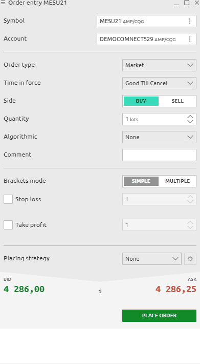
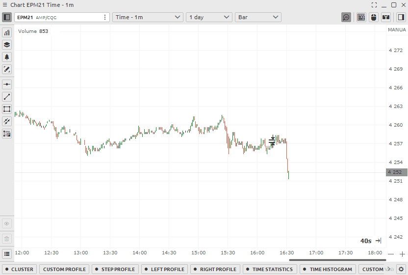

# Order Entry for CQG

Placing of orders on the Quantower platform can be done in several ways:

* using the Order Entry panel \(OE\)
* Quick order placement through the chart area with a mouse \(visual trading\)
* via **DOM Trader panel**

### **How to place an order from the OE \(Order Entry\) panel**

* **How to open the Order Entry panel**
* **General view of the OE \(Order Entry\) panel for AMP/CQG**
* **Order parameters — Type, Price, Quantity, TP \(take profit\) and SL \(stop loss\)**

### **How to place an order from the Chart trading sidebar**

* **General view of Chart** 
* **Order quantity selection**
* **Quick order quantity buttons**
* B**uttons for fast change of order volume Order parameters - type, TIF, price, algorithmic settings TP \(take profit\) and SL stop limit \(stop loss\) orders**

### How to open the Order Entry panel?

Open the main menu by clicking the logo and in the **Trading section** click on the OE icon.

### The general view of the Order Entry panel for CQG connection 

The entire panel is conventionally divided into several **zones**:

* choice of trading instrument and trading account;
* setting the required order type, TIF condition, order quantity, and the order side \(Buy or Sell\);
* setting of the order price, stop loss and take profit prices;
* order placing strategy for advanced trading algorithms
* information on current Ask and Bid prices, spread size, as well as an order placement button

### Selection of Order Type, Time if Force and Order Quantity

AMP/CQG exchange provides 2 main order types: **Market, Limit**

 

All contracts in AMP/CGQ are standardized with leverage. This means that to set the entry volume you need to specify in the Quantity field the required number of contracts. Specification of the contracts you can get on the AMP official website.

### How to set up traling order

AMP/CQG support **server-side trailing orders**. To set such an order you must Select order type select TRAIL item in Algorithmic trading Specify the parameters of this Price and the offset for the movement

## CQG OrderTypes, Time in Force \(TIF\), Algorithmic in Quantower

CQG provides various order types for trading via the Order Entry panel:

* Market order
* Limit order
* Stop order
* Stop limit order

**Time-in-force \(TIF\)** instructions define the length of time over which an order will continue working before it is canceled. CQG provides various TIFs:

* **GTC \(Good till canceled\)** — orders will remain working until they are canceled by trader or the contract expires;
* **FOK \(or Fill or Kill\)** —  order will be canceled if it is not executed in the entire volume as soon as it becomes available;
* **IOC \(Immediate or cancel\)** — requires that any portion of an order that is not filled as soon as it becomes available in the market is canceled;
* **DAY** — order will be canceled if it is not executed within the current trading day;
* **GTD \(Good till date\)** — order will remain working within the system and in the marketplace, until it executes or until the close of the market on the date specified.
* **GTT \(Good till time\)** — order that remains open until a specified time. At that time, any unfilled lots are canceled.
* **FAK** \(**Fill and Kill\)** — ****orders require that any remaining quantity after a partial fill be canceled.
* **ATC \(At the Close Order\)** — order to buy or sell a stock at the closing price. One of the benefits of this type of order is that it can be placed prior to the actual end of the trading day requested. This would be the opposite of an at-the-open order.
* **ATO \(At-The-Open Order\)** — order to buy or sell a stock at the opening price. ATO order is allowed during pre-open sessions \(morning and afternoon\) or even the night before.

### How to set up Profit and Stop orders

Then you can set **automatic stop loss and profit** in pips. It's very convenient to set the lot size and protect it. Specify your values in the appropriate fields.


Some brokers such as Binance do not allow stop orders for limit orders. \(Until the position is NOT open\) In this case, use limit orders of the opposite direction


* Use the Qquick Ttrade toolbar 
* Set your values for stop loss or profit. You can also use any one parameter only. 
* Use the button to activate the trade with the mouse to set a limit order


If you execute an order at market, the specified stop parameters will retain their values and will be set immediately.


### How to set up  multiple Profit and Stop orders for one position

* To set multiple stop orders for a single position, do the following Switch the bracket \(stop\) settings to multi mode 
* Enter data for setting the first limit orders and how many lots or coins should be closed 
* For the next stops, enter similar data on the next line.
*  You can set orders in multiples of your total volume.

