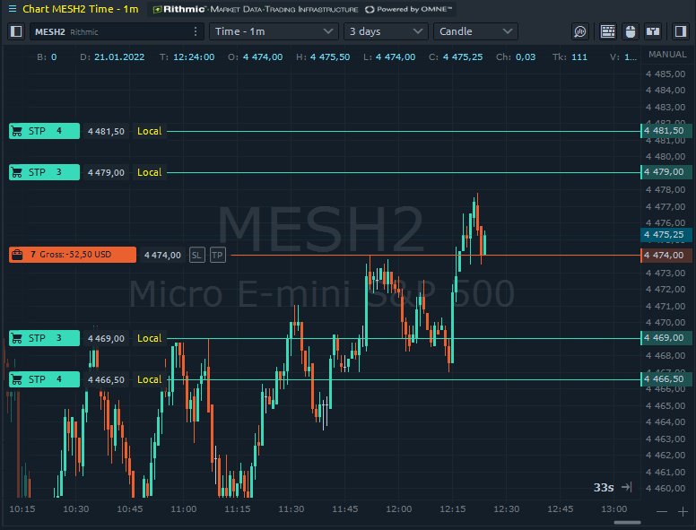

# Local SL/TP

## Before the use in live trading

Quantower provides this functionality using the Orders placing strategy feature, meaning that all of the Local orders are solely handled on the platform side (literally "on your machine"). Such behavior leads to some important notices and limitations that users should understand before use of Local closing orders:


<mark style="color:orange;">**We insist that you read, practice, and understand how the Local closing orders work before using them for live trading.**</mark>&#x20;



**Local SL/TP orders exist and managed on the platform side ("on your machine").**&#x20;



**When you close the platform, it will permanently **<mark style="color:red;">**delete ALL Local SL/TP orders**</mark>**.**&#x20;



**When your platform loses connection, it will permanently **<mark style="color:red;">**delete all Local SL/TP orders related to this connection**</mark>**, and you won't be able to restore them after reconnecting.**



**Please, do not use **<mark style="color:blue;">**Reverse**</mark>** and **<mark style="color:blue;">**Breakeven**</mark>** buttons with orders and positions containing Local SL/TP orders to avoid unexpected behavior.**


## How to use Local SL/TP?

To add a local Stop loss and Take profit orders, you should find the Placing automation control in any Order entry (separate panel or in the sidebars) and choose the "Local SL/TP" option. During the first selection, the platform will notify you about the possibility to read the documentation on this feature and agree to the risks to trading that may occur.

 (1).png>)

Next, you should open the Local SL/TP settings and set them up as you require.&#x20;

 (1) (1).png>)

Here you will find the following parameters:

.png>)

* **Orders price specification** (relative to parent price). \
  Offset in Ticks, Percentage & Absolute price value. It will specify in what values should the closing orders price be set.
* **Type of closing orders.**\
  ****What orders should send as closing. Stop or Limit (useful for some crypto exchanges, to reduce commissions)
* **Orders placement modes.**\
  ****Simple SL/TP or Multiple brackets (up to 3 tiers). Various schemes of placement.
* **Closing quantity.**\
  ****Option for the Simple SL/TP scheme, specifying how the active Local SL/TP should behave when the related parent order/position changes its quantity. With the **Whole position** option, the strategy will try to modify the closing orders. With the **Initial** choice, the strategy will not modify local closing orders quantity.
* **is trailing.**\
  ****An option to make Simple SL or TP trailing (changing while the price moves)
* **Tier 1, 2, 3.**\
  ****The closing levels for brackets scheme. You should activate the level and set its closing parameters.

Once you have finished setting up your Local SL/TP, just close the settings screen and place your order as usual. In case of any incorrect parameters, the platform will inform you in deal tickets of message screens.

Local orders are also parent-related, meaning that each time you create an order or position with Local SL/TP, they will be connected as "parent and child." The platform will monitor the parent order/position state and automatically close its Local "Childs" on close or cancel, so you don't need to do this manually.

### Where to monitor placing strategies?

You can track your active strategies for Local SL/TP in the [Order placing strategies panel](./#order-placing-strategies-panel). There you will find the strategy status and detailed logs about its operation.

There is a possibility to see and manage Local orders in any Quantower panel as usual server-side orders. You will see a specific "Local" label placed alongside each local order in the Working orders, Chart, DOM trader, and other panels.

.png>)

### Mixing with broker's native SL/TP

While the trader can use the functionality of the Local orders with connections that support SL/TP orders natively, <mark style="color:orange;">**we strongly recommend avoiding mixing them**</mark>. The platform will show a warning message each time you try to use both simultaneously.
