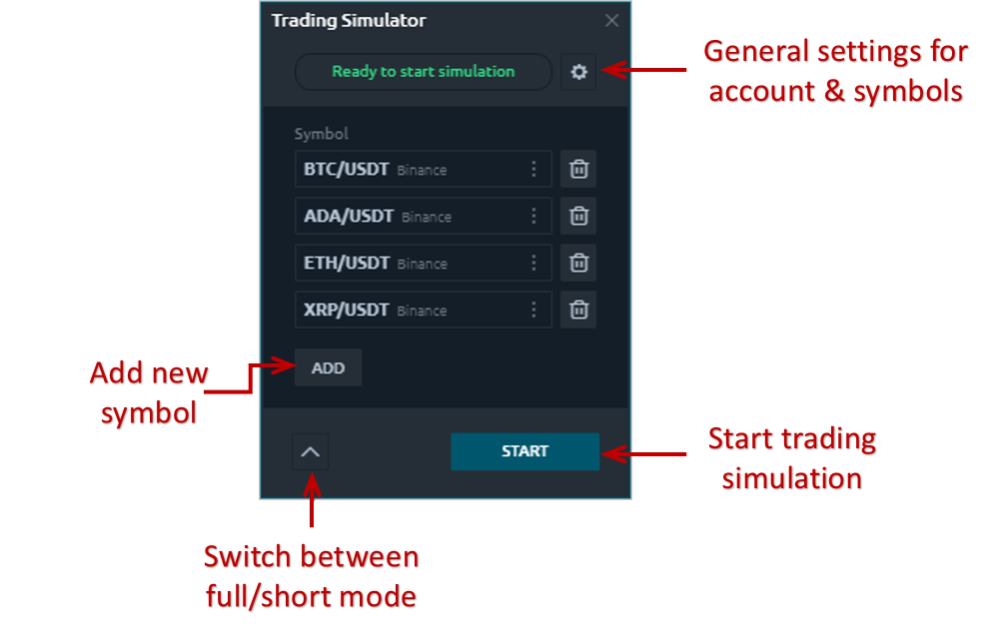
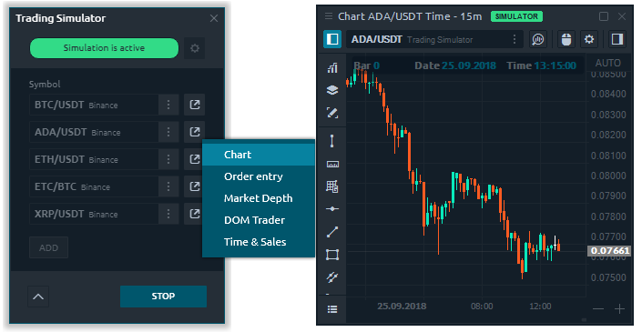
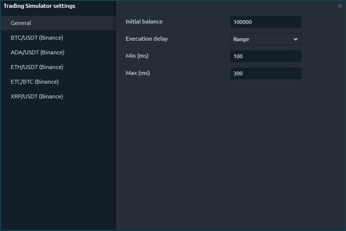
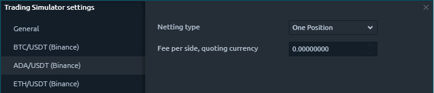

# Trading simulator

### What is Trading Simulator?

Trading Simulator is a specially designed trading tool that allows emulating the execution of orders for any connection, including those that do not allow trading.

For whom it will be useful? For any trader - from beginner to pros, trading in with any type of instrument. For example, crypto traders who do not have real accounts on a crypto exchange can trade in the demo mode on the selected crypto exchange.

### How to start trading simulation?

* Launch the **Trading Simulator** from the Control Center. The panel is located in the _Trading_ category.
* Add desired symbols on which the trading simulation will take place.
* Set the initial balance for trading accounts, execution delay, type of netting for selected symbols, and commission size. 
* Run the simulation by clicking the "**Start**" button. The status of the panel changes to _**Simulation is active.**_
* Open required panels for analysis and trading. On the header of each panel which participates in the trading simulation, shows the corresponding inscription — **Simulator**.


"**Stop**" button will abort the simulation process as well as cancel all positions and orders.


### General settings

In the general settings, you can set the initial balance for the test account, set the delay in execution, and configure the settings of netting for each instrument.

* **Initial balance** — the amount of money for the test account.


Trading Simulator creates separate trading accounts for each base currency of the instrument. For example, if you chose EUR / USD currency pair, then the account name will be **Account \(USD\)**, if you select EUR / JPY, then the name will be **Account \(JPY\)** respectively.


* **Execution Delay** — the length of time between the acceptance of an order and its execution. In the real market, this parameter affects on the slippage.  There are 3 options for the delay: _Range_, _Fix_ and _None_ \(instant execution\).

* **Netting type** — methods by which to summarize existing and new positions. There are 3 types of nettings: **One Position**, **Multiple Per Side**, **Multiple Positions**. Examples of using each method you can find in the description of the [History Player panel settings](https://help.quantower.com/trading-panels/history-player#general-and-instruments-settings).

