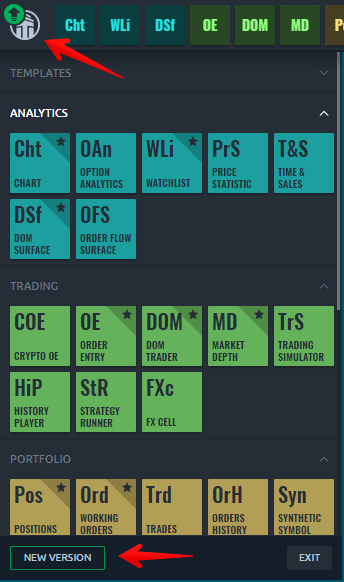
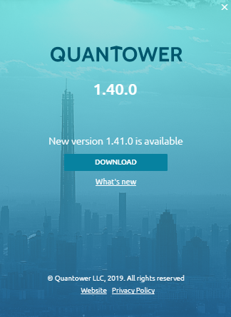
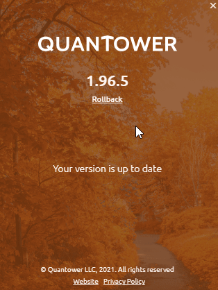

# Platform update

* [**Quantower Beta version**](quantower-beta.md)

Our team strives to release new updates as soon as possible, usually at least a couple of times per month.

Quantower automatically checks for updates on start and re-checks them every 10 minutes in the background. It helps you to get to know about the latest updates just after we release them.

When a new version is available, a green arrow appears next to the logo. Click the logo to open the sidebar, then press the "**NEW VERSION**" button at the bottom to reach the About screen.

Click "_**DOWNLOAD**_", and Quantower will download the latest version and prepare it for the update. When the download process is finished, Quantower will ask you about the restart. This action is required to apply the new version, but you can cancel the reboot and proceed using an application. In this case, updates will be applied on the next start of Quantower.


Restarting to update closes and reopens Quantower with the new version. It takes a moment, and trading is unavailable while it happens.


Your local settings carry over to every update — the process replaces the Core files only, so nothing you've set up is lost.

If your version falls too far behind, Quantower will prompt you to update to avoid issues with connections and trading.

.png>)

## Rollback to the previous version

Need to step back? The rollback function lets you return to any previously supported version in a few clicks.

Curious what's coming next? Join the [**Quantower Beta version**](quantower-beta.md) to test new features before they release.

